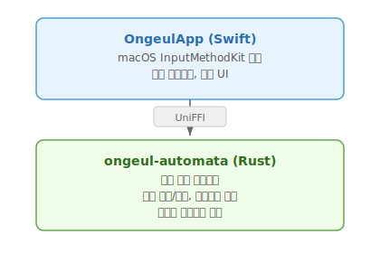

# Ongeul (온글)

macOS용 한글 입력기 — 하나의 입력 소스로 한글과 영문을 모두 처리합니다.

**[문서](https://hiking90.github.io/ongeul/)** · **[릴리스](https://github.com/hiking90/ongeul/releases)**

<p align="center">
  
</p>

## 왜 Ongeul인가?

macOS 기본 한글 입력기는 한/영 전환 시 **입력 소스를 전환**합니다. 이 과정에서 InputMethodKit의 세션 간섭 버그로 인해 글자가 씹히거나 지연이 발생할 수 있습니다.

Ongeul은 **단일 입력 소스** 안에서 한글과 영문을 모두 처리하여 이 문제를 근본적으로 해결합니다.

|                  | 기존 입력기              | Ongeul           |
| ---------------- | ------------------------ | ---------------- |
| 영문 입력        | 시스템에 위임 (ABC 전환) | 엔진이 직접 입력 |
| 등록된 입력 소스 | 2개 (한글 + ABC)         | 1개 (Ongeul만)   |
| 한/영 전환       | macOS 입력 소스 전환     | 내부 모드 전환   |
| 세션 간섭        | 발생 가능                | 원천 차단        |

## 주요 기능

- **키보드 레이아웃** — 두벌식 표준, 세벌식 390, 세벌식 최종
- **한/영 전환** — 오른쪽 Command (기본값) 또는 Shift + Space
- **모드 인디케이터** — 커서 근처에 현재 모드 (한/A) 표시
- **앱별 모드 기억** — 앱마다 마지막 입력 모드 자동 복원
- **영문 잠금** — 특정 앱을 영문 전용으로 고정
- **CapsLock 정규화** — 한글 모드에서 CapsLock 무시
- **한글 조합 오토마타** — 두벌식 6단계 상태 머신, 세벌식 지원

각 기능의 상세 설명은 [문서 사이트](https://hiking90.github.io/ongeul/user/features/index.html)를 참고하세요.

## 아키텍처

Rust 엔진 + Swift 프론트엔드 하이브리드 구조. [UniFFI](https://mozilla.github.io/uniffi-rs/)를 통한 FFI 바인딩으로 연결됩니다.

<p align="center">
  
</p>

- **rshangul** (Rust): 한글 조합의 모든 로직을 담당. Swift 쪽에는 한글 처리 로직이 전혀 없음.
- **OngeulApp** (Swift): 키 이벤트 수신 → Rust 엔진에 위임 → 결과 적용의 얇은 셸 역할.

## 빌드

### 요구사항

- macOS 14.0 (Sonoma) 이상
- Rust toolchain (`aarch64-apple-darwin`)
- Xcode / Swift toolchain
- (선택) Intel 빌드: `rustup target add x86_64-apple-darwin`

### 빌드 및 설치

```bash
# 빌드만
./scripts/build.sh

# 빌드 + ~/Library/Input Methods에 설치
./scripts/install.sh

# universal .pkg 생성
./scripts/package.sh
```

### 설치 후 설정

1. **로그아웃/로그인** (최초 설치 시 필요)
2. 시스템 설정 → 키보드 → 입력 소스 → 편집 → + → **Ongeul** 추가
3. 기존 한글 입력기 제거 (ABC는 남겨둬도 무방)
4. ABC를 남긴 경우, "Caps Lock으로 ABC 입력 소스 전환" 옵션 비활성화

## 테스트

```bash
cargo test -p rshangul
```

## 디버그 로그

```bash
log stream --predicate 'subsystem == "io.github.hiking90.inputmethod.Ongeul"'
```

## 라이선스

[Apache License 2.0](LICENSE)
