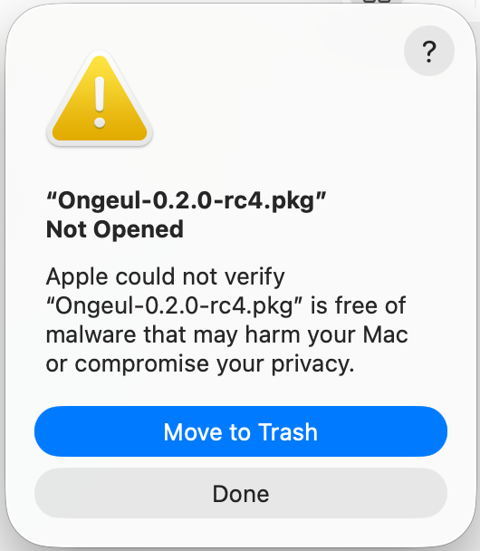
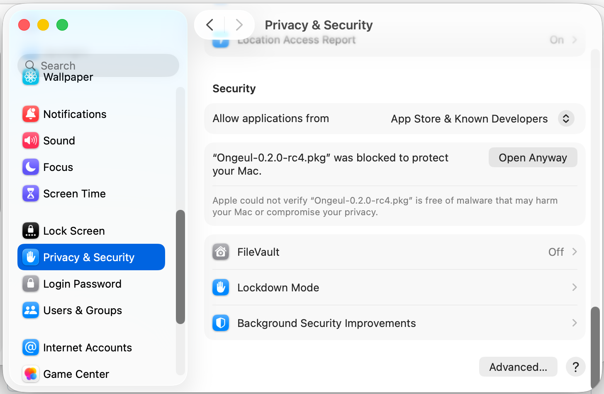
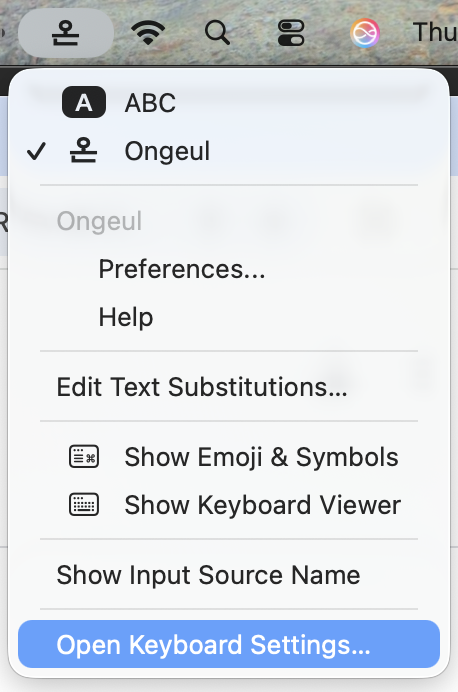
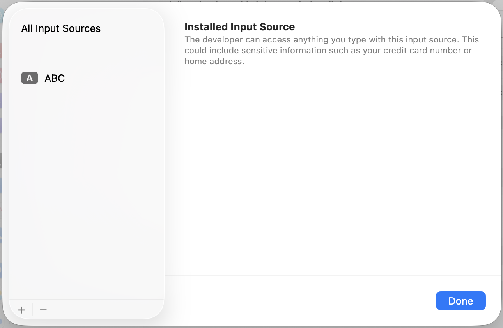
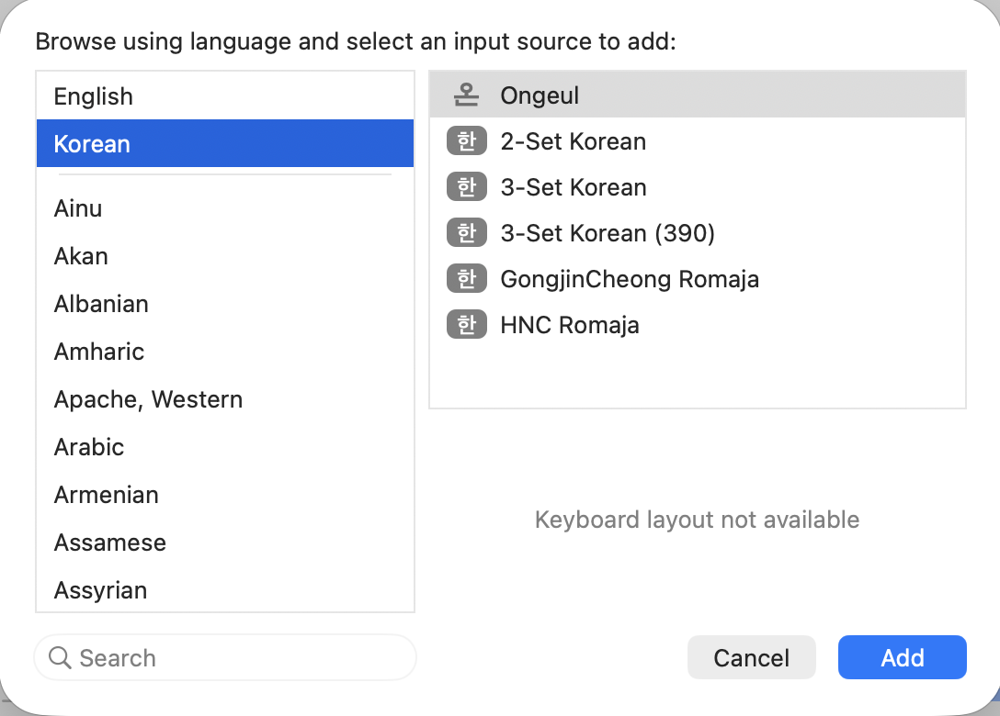
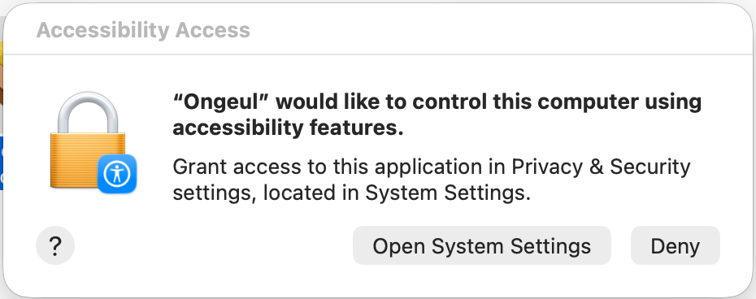

# 설치

## .pkg 설치 (권장)

1. [GitHub Releases](https://github.com/hiking90/ongeul/releases) 페이지에서 최신 `.pkg` 파일을 다운로드합니다.
2. 다운로드한 `.pkg` 파일을 더블클릭합니다.
3. Installer의 안내에 따라 설치합니다.
   - **시스템 전체 설치**: `/Library/Input Methods`에 설치됩니다 (관리자 권한 필요).
   - **현재 사용자만**: `~/Library/Input Methods`에 설치됩니다.

### 실행 권한 (Gatekeeper)

Ongeul은 오픈소스 프로젝트로, Apple Developer 인증서로 서명되거나 공증(notarization)되어 있지 않습니다. 이 때문에 macOS Gatekeeper가 설치 파일과 앱 실행을 차단합니다. 이는 보안 위협이 아니라 Apple 개발자 프로그램에 등록되지 않은 소프트웨어에 대한 macOS의 기본 정책입니다.

#### .pkg 파일 열기

다운로드한 `.pkg` 파일을 더블클릭하면 다음과 같은 경고가 표시될 수 있습니다.

<p align="center">

</p>

1. 경고 다이얼로그에서 **완료** 를 클릭합니다.
2. **시스템 설정** → **개인 정보 보호 및 보안** 으로 이동합니다.
3. 하단의 보안 섹션에서 **"Ongeul-x.x.x.pkg이(가) Mac을 보호하기 위해 차단되었습니다"** 메시지를 확인하고 **확인 없이 열기** 를 클릭합니다.

<p align="center">

</p>

4. macOS가 다시 확인을 요청하면 **열기** 를 클릭합니다.

> 이 과정은 최초 1회만 필요합니다. 이후에는 Gatekeeper가 Ongeul을 차단하지 않습니다.

### 입력기 등록

`.pkg` 설치가 완료되면, macOS에 Ongeul을 입력 소스로 등록해야 합니다. 등록하지 않으면 Ongeul이 설치되어 있어도 입력기로 사용할 수 없습니다.

> 최초 설치 시 macOS가 새 입력기를 인식하려면 **로그아웃 후 재로그인**이 필요할 수 있습니다. 입력 소스 목록에 Ongeul이 보이지 않는다면 로그아웃 후 다시 시도하세요.

1. 메뉴 막대 우측의 **입력기 아이콘** 을 클릭합니다.
2. 드롭다운 메뉴 하단의 **"Open Keyboard Settings..."** 를 선택합니다.

<p align="center">

</p>

3. 현재 설정된 입력 소스 목록이 표시됩니다. 좌측 하단의 **+** 버튼을 클릭합니다.

<p align="center">

</p>

4. 왼쪽 언어 목록에서 **한국어** 를 선택합니다.
5. 오른쪽에 나타나는 입력기 목록에서 **Ongeul** 을 선택하고 **추가** 를 클릭합니다.

<p align="center">
 Ongeul 선택" width="450">
</p>

#### 기존 입력 소스 정리

Ongeul은 한글과 영문을 모두 하나의 입력기에서 처리하므로, 기존 한글 입력기(예: 2-Set Korean)는 제거하는 것을 권장합니다.

1. 입력 소스 목록에서 기존 **한글 입력기**를 선택하고 **−** 버튼으로 제거합니다.

> **ABC** 입력 소스는 macOS 기본 입력기로 삭제할 수 없습니다. Ongeul이 영문 입력도 처리하므로 ABC가 남아 있어도 무방합니다.

> 기존 한글 입력기를 제거하고 Ongeul만 사용하면 입력 소스 전환으로 인한 지연이 크게 줄어듭니다. 자세한 설정은 [시작하기](getting-started.md) 페이지를 참고하세요.

### 손쉬운 사용(Accessibility) 권한

Ongeul은 **손쉬운 사용(Accessibility)** 권한이 필요합니다. 이 권한이 부여되면 Ongeul이 시스템 레벨에서 키 이벤트를 가로채어(CGEventTap) 모든 앱에서 안정적으로 동작합니다.

#### 왜 필요한가요?

macOS의 입력기 프레임워크(InputMethodKit)만으로는 해결할 수 없는 앱별 호환성 문제들이 있습니다. Accessibility 권한이 부여되면 Ongeul이 시스템 레벨(CGEventTap)에서 키 이벤트를 직접 처리하여 이러한 문제를 해결합니다.

- **토큰 필드 조합 글자 중복**: 메시지 앱의 "받는 사람" 입력창 등 토큰 필드(NSTokenField)에서 한글 조합 중 Enter를 누르면 마지막 조합 글자가 중복 입력되는 macOS 버그가 있습니다. 예를 들어 "홍길동"을 입력하고 Enter를 누르면 토큰 `[홍길동]` 옆에 "동"이 추가로 나타납니다. Accessibility 권한이 있으면 텍스트 확정과 Enter 키 전달을 별도 이벤트 사이클로 분리하여 이 문제를 방지합니다.
- **Shift+Space 한/영 전환 시 공백 삽입**: JetBrains IDE(RustRover, IntelliJ, WebStorm 등), iTerm2 등 일부 앱은 자체적인 키 입력 처리를 구현하여 입력기의 키 처리 결과를 무시합니다. 이로 인해 Shift+Space로 한/영 전환 시 공백 문자가 함께 삽입됩니다. Accessibility 권한이 있으면 키 이벤트가 앱에 도달하기 전에 시스템 레벨에서 가로채므로 이 문제가 발생하지 않습니다.

> 권한이 없어도 기본적인 한글 입력과 오른쪽 Command 전환은 정상 동작합니다. 위 문제들이 발생하는 특정 앱에서만 차이가 있으며, 해당 상황에서는 기존 방식으로 폴백하여 동작합니다.

#### 권한 설정 방법

Ongeul을 입력 소스로 등록하고 처음 활성화하면, 다음과 같은 Accessibility 권한 요청 다이얼로그가 자동으로 표시됩니다.

<p align="center">

</p>

1. 다이얼로그에서 **"Open System Settings"** 를 클릭합니다.
2. **손쉬운 사용** 설정 화면이 열리면 목록에서 **Ongeul** 을 찾아 토글을 켭니다.

**다이얼로그가 표시되지 않는 경우:**

1. **시스템 설정** 을 엽니다.
2. **개인 정보 보호 및 보안** → **손쉬운 사용** 을 선택합니다.
3. 목록에서 **Ongeul** 을 찾아 토글을 켭니다.
4. 목록에 Ongeul이 보이지 않는 경우, 하단의 **+** 버튼을 클릭하고 `/Library/Input Methods/Ongeul.app` (시스템 전체 설치) 또는 `~/Library/Input Methods/Ongeul.app` (현재 사용자 설치)을 선택합니다.

> **업데이트 시 참고**: Ongeul을 업데이트하면 앱이 재서명되어 기존 Accessibility 권한이 자동으로 초기화됩니다. 업데이트 후 Ongeul을 처음 활성화하면 권한 요청 다이얼로그가 다시 표시되므로, 위 절차에 따라 권한을 다시 부여해 주세요.

## 소스에서 빌드

개발 환경에서 직접 빌드하려면 [빌드](../dev/building.md) 페이지를 참고하세요.

```bash
# 빌드 + 설치
./scripts/install.sh
```

## 요구사항

- macOS 14.0 (Sonoma) 이상
- Apple Silicon (aarch64) 또는 Intel (x86_64)
